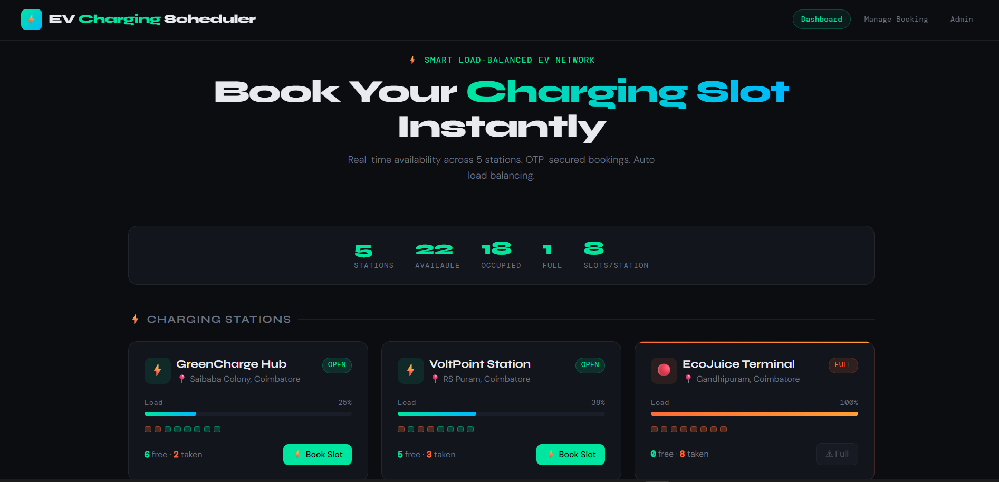
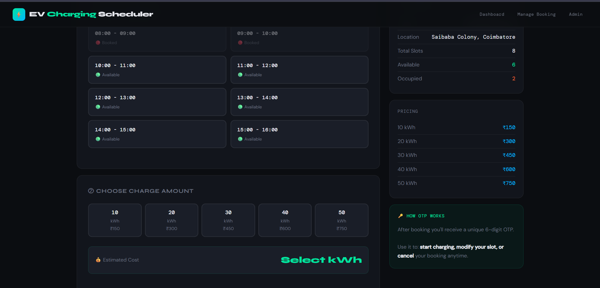

# ⚡ EV Charging Slot Booking System

## 📸 Screenshots

## 📌 Description

A web-based EV charging slot booking system built using Flask, HTML, and CSS.
This project simulates booking and managing EV charging stations.

---

## 🚀 Features

* 🔌 Slot booking system
* ⚡ Charging amount selection
* 🔐 OTP-based booking simulation
* 👨‍💼 Admin panel to view bookings
* 📊 Station load display

---

## 🛠️ Tech Stack

* Python (Flask)
* HTML
* CSS

---

##▶️ How to Run

• Install Python  
• Install Flask  
• Run:  
python app.py
• Open:  
http://127.0.0.1:5000

---

##📁 Project Structure
• app.py → main backend
• templates/ → frontend HTML
• static/ → CSS files

## ⚠️ Note

This project uses pre-defined data for simulation.
Future updates will include database integration.

---

## 👨‍💻 Author

Thanishkar
